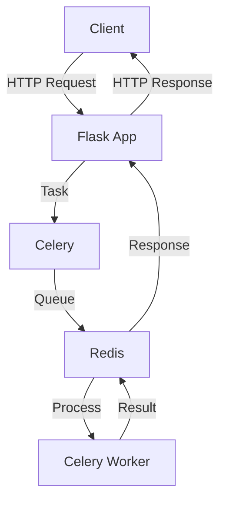

# TTSFM

[](https://hub.docker.com/r/dbcccc/ttsfm)
[](LICENSE)
[](https://github.com/dbccccccc/ttsfm)

> ⚠️ **Disclaimer**  
> This project is for learning & testing purposes only. For production use, please use the [official OpenAI TTS service](https://platform.openai.com/docs/guides/audio).

> 🚨 **IMPORTANT DEVELOPMENT NOTICE** 🚨  
> ⚠️ The v2 branch is currently under active development and is not recommended for production use. 
> 📚 For stable documentation and usage, please refer to the [v1 documentation](v1/README_v1.md).

English | [中文](README_CN.md)

## 🌟 Project Overview

TTSFM is a API server that's fully compatible with OpenAI's Text-to-Speech (TTS) API format.

> 🎮 Try it now: [Official Demo](https://ttsapi.site/)

## 🏗️ Project Structure

```text
ttsfm/
├── app.py              # Main Flask application
├── celery_worker.py    # Celery configuration and tasks
├── requirements.txt    # Python dependencies
├── static/            # Frontend resources
│   ├── index.html     # English interface
│   ├── index_zh.html  # Chinese interface
│   ├── script.js      # Frontend JavaScript
│   └── styles.css     # Frontend styles
├── voices/            # Voice samples
├── Dockerfile         # Docker configuration
├── docker-entrypoint.sh # Docker startup script
├── .env.example       # Environment variables template
├── .env              # Environment variables
├── .gitignore        # Git ignore rules
├── LICENSE           # MIT License
├── README.md         # English documentation
├── README_CN.md      # Chinese documentation
├── test_api.py       # API test suite
├── test_queue.py     # Queue test suite
└── .github/          # GitHub workflows
```

## 🚀 Quick Start

### System Requirements
- Docker and Docker Compose
- or Python ≥ 3.8 with Redis

### 🐳 Docker Run (Recommended)

Basic usage:
```bash
docker run -p 7000:7000 -p 6379:6379 dbcccc/ttsfm:latest
```

Custom configuration with environment variables:
```bash
docker run -d \
  -p 7000:7000 \
  -p 6379:6379 \
  -e HOST=0.0.0.0 \
  -e PORT=7000 \
  -e VERIFY_SSL=true \
  -e MAX_QUEUE_SIZE=100 \
  -e RATE_LIMIT_REQUESTS=30 \
  -e RATE_LIMIT_WINDOW=60 \
  -e CELERY_BROKER_URL=redis://localhost:6379/0 \
  -e CELERY_RESULT_BACKEND=redis://localhost:6379/0 \
  dbcccc/ttsfm:latest
```

Available environment variables:
- `HOST`: Server host (default: 0.0.0.0)
- `PORT`: Server port (default: 7000)
- `VERIFY_SSL`: Verify SSL certificates (default: true)
- `MAX_QUEUE_SIZE`: Maximum queue size (default: 100)
- `RATE_LIMIT_REQUESTS`: Maximum requests per time window (default: 30)
- `RATE_LIMIT_WINDOW`: Rate limit time window in seconds (default: 60)
- `CELERY_BROKER_URL`: Redis broker URL (default: redis://localhost:6379/0)
- `CELERY_RESULT_BACKEND`: Redis result backend URL (default: redis://localhost:6379/0)

### 📦 Manual Installation

1. Clone the repository:
```bash
git clone https://github.com/dbccccccc/ttsfm.git
cd ttsfm
```

2. Install dependencies and start:
```bash
cd flask_app
pip install -r requirements.txt

# Start Redis server
redis-server

# In a new terminal, start Celery worker
celery -A celery_worker.celery worker --pool=solo -l info

# In another terminal, start Flask application
python app.py
```

## 📚 Usage Guide

### Web Interface
Visit `http://localhost:7000` for the interactive demo

### API Endpoints
| Endpoint | Method | Description |
|----------|--------|-------------|
| `/v1/audio/speech` | POST | Text to Speech |
| `/api/queue-size` | GET | Query task queue |
| `/api/voice-sample/<voice>` | GET | Get voice sample |
| `/api/version` | GET | Get API version |

> 🔍 Complete API documentation is available in the web interface after local deployment

## 🔧 Architecture

The application uses a distributed task queue architecture:

1. **Flask Application**: Handles HTTP requests and serves the web interface
2. **Celery**: Manages asynchronous task processing
3. **Redis**: Acts as message broker and result backend
4. **Task Queue**: Processes TTS requests asynchronously



## 🤝 Contributing

We welcome all forms of contributions! You can participate by:

- Submitting [Issues](https://github.com/dbccccccc/ttsfm/issues) to report problems
- Creating [Pull Requests](https://github.com/dbccccccc/ttsfm/pulls) to improve code
- Sharing usage experiences and suggestions

📜 Project licensed under [MIT License](LICENSE)

## 📈 Project Activity

[](https://star-history.com/#dbccccccc/ttsfm&Date) 