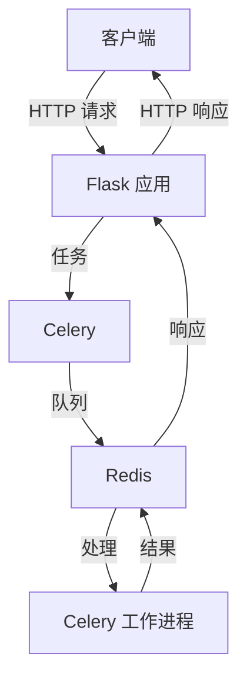

# TTSFM

[](https://hub.docker.com/r/dbcccc/ttsfm)
[](LICENSE)
[](https://github.com/dbccccccc/ttsfm)

> ⚠️ **免责声明**  
> 此项目仅用于学习测试，生产环境请使用 [OpenAI 官方 TTS 服务](https://platform.openai.com/docs/guides/audio)。

> ⚠️ **开发公告**  
> v2 分支目前正在积极开发中，不建议用于生产环境。请使用最新的稳定发布版本。
 
[English](README.md) | 中文

## 🌟 项目简介

TTSFM 是一个 API 服务器，完全兼容 OpenAI 的文本转语音(TTS)接口。

> 🎮 立即体验：[官方演示站](https://ttsapi.site/) 

## 🏗️ 项目结构

```text
ttsfm/
├── app.py              # Flask 主应用
├── celery_worker.py    # Celery 配置和任务
├── requirements.txt    # Python 依赖
├── static/            # 前端资源
│   ├── index.html     # 英文界面
│   ├── index_zh.html  # 中文界面
│   ├── script.js      # 前端JavaScript
│   └── styles.css     # 前端样式
├── voices/            # 语音样本
├── Dockerfile         # Docker配置
├── docker-entrypoint.sh # Docker启动脚本
├── .env.example       # 环境变量模板
├── .env              # 环境变量
├── .gitignore        # Git忽略规则
├── LICENSE           # MIT许可证
├── README.md         # 英文文档
├── README_CN.md      # 中文文档
├── test_api.py       # API测试套件
├── test_queue.py     # 队列测试套件
└── .github/          # GitHub工作流
```

## 🚀 快速开始

### 系统要求
- Docker 和 Docker Compose
- 或 Python ≥ 3.8 和 Redis

### 🐳 Docker 运行（推荐）

基本用法：
```bash
docker run -p 7000:7000 -p 6379:6379 dbcccc/ttsfm:latest
```

使用环境变量自定义配置：
```bash
docker run -d \
  -p 7000:7000 \
  -p 6379:6379 \
  -e HOST=0.0.0.0 \
  -e PORT=7000 \
  -e VERIFY_SSL=true \
  -e MAX_QUEUE_SIZE=100 \
  -e RATE_LIMIT_REQUESTS=30 \
  -e RATE_LIMIT_WINDOW=60 \
  -e CELERY_BROKER_URL=redis://localhost:6379/0 \
  -e CELERY_RESULT_BACKEND=redis://localhost:6379/0 \
  dbcccc/ttsfm:latest
```

可用的环境变量：
- `HOST`：服务器主机（默认：0.0.0.0）
- `PORT`：服务器端口（默认：7000）
- `VERIFY_SSL`：是否验证 SSL 证书（默认：true）
- `MAX_QUEUE_SIZE`：队列最大任务数（默认：100）
- `RATE_LIMIT_REQUESTS`：每个时间窗口的最大请求数（默认：30）
- `RATE_LIMIT_WINDOW`：速率限制的时间窗口（秒）（默认：60）
- `CELERY_BROKER_URL`：Redis 代理 URL（默认：redis://localhost:6379/0）
- `CELERY_RESULT_BACKEND`：Redis 结果后端 URL（默认：redis://localhost:6379/0）

### 📦 手动安装

1. 克隆仓库：
```bash
git clone https://github.com/dbccccccc/ttsfm.git
cd ttsfm
```

2. 安装依赖并启动：
```bash
pip install -r requirements.txt

# 启动 Redis 服务器
redis-server

# 在新终端中启动 Celery 工作进程
celery -A celery_worker.celery worker --pool=solo -l info

# 在另一个终端中启动 Flask 应用
python app.py
```

## 📚 使用指南

### Web 界面
访问 `http://localhost:7000` 体验交互式演示

### API 端点
| 端点 | 方法 | 描述 |
|------|------|-------------|
| `/v1/audio/speech` | POST | 文本转语音 |
| `/api/queue-size` | GET | 查询任务队列 |
| `/api/voice-sample/<voice>` | GET | 获取语音样本 |
| `/api/version` | GET | 获取 API 版本 |

> 🔍 完整 API 文档可在本地部署后通过 Web 界面查看

## 🔧 架构

应用采用分布式任务队列架构：

1. **Flask 应用**：处理 HTTP 请求并提供 Web 界面
2. **Celery**：管理异步任务处理
3. **Redis**：作为消息代理和结果后端
4. **任务队列**：异步处理 TTS 请求



## 🤝 参与贡献

我们欢迎所有形式的贡献！您可以通过以下方式参与：

- 提交 [Issue](https://github.com/dbccccccc/ttsfm/issues) 报告问题
- 发起 [Pull Request](https://github.com/dbccccccc/ttsfm/pulls) 改进代码
- 分享使用体验和建议

📜 项目采用 [MIT 许可证](LICENSE)

## 📈 项目动态

[](https://star-history.com/#dbccccccc/ttsfm&Date)